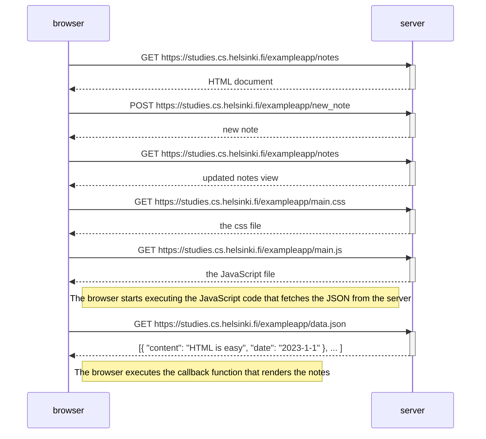
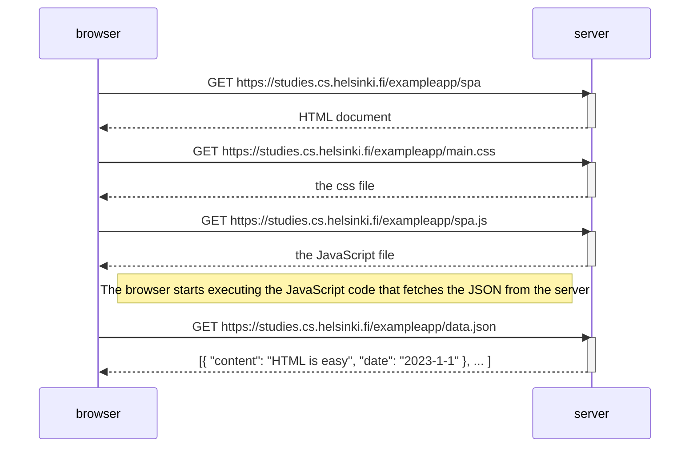
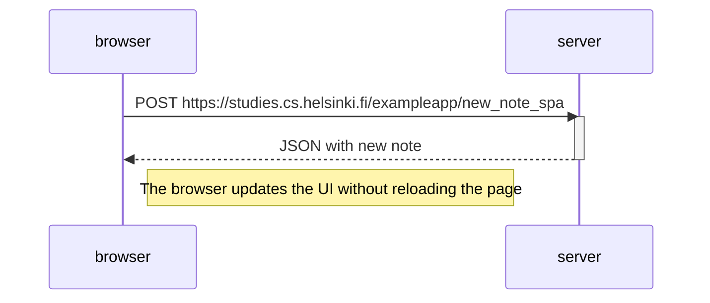

<h1>0.4: Nuevo diagrama de nota</h1>

<h1>0.5: Diagrama de aplicación de una sola página</h1>

<h1>0.6: Nueva nota en diagrama de aplicación de una sola página</h1>

En una SPA, JavaScript modifica el DOM directamente usando los datos recibidos del servidor, sin recargar la página.
 

1.- El usuario escribe una nota y pulsa el botón de guardar.

2.- JavaScript captura el evento y evita que la página se recargue.

3.- JavaScript envía la nota al servidor usando una petición POST.

4.- El servidor guarda la nota y responde con los datos en formato JSON.

5.- JavaScript recibe la respuesta del servidor.

6.- JavaScript actualiza el HTML existente modificando el DOM.

7.- El navegador muestra la nueva nota sin recargar la página. 
 

La página no se recarga porque JavaScript modifica el DOM con los datos recibidos del servidor en lugar de solicitar un nuevo documento HTML.

